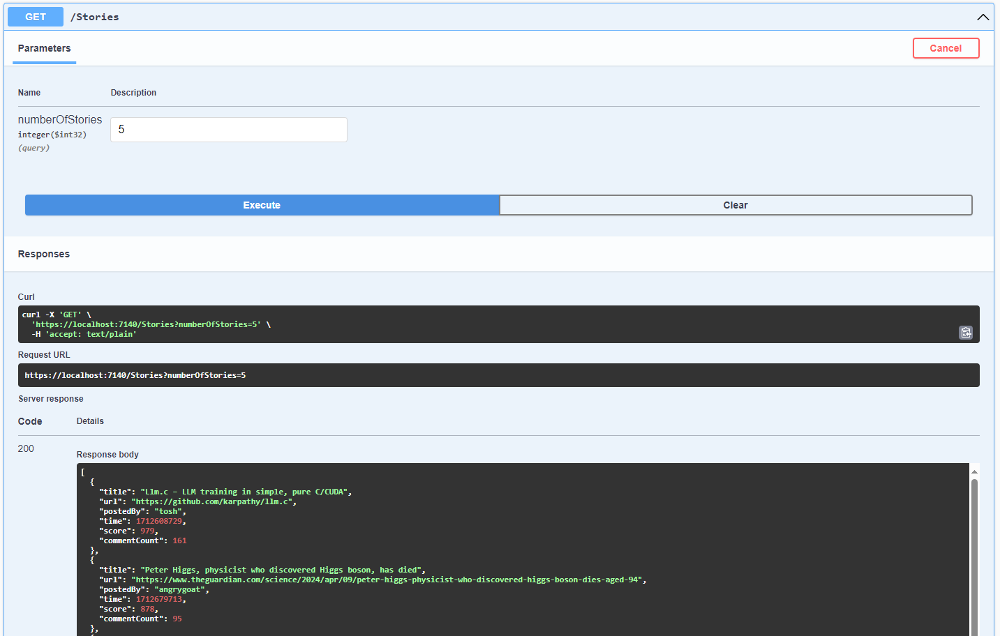

# TopStoriesAPI
RESTful API .NET 8 project using ASP.NET Core Web API, LazyCache, HackerNews API, NUnit, Moq and NLog

## Overview
This repository contains solution to developer coding test:

>Using ASP.NET Core, implement a RESTful API to retrieve the details of the best n stories from the Hacker News API, as determined by their score, where n is specified by the caller to the API.

The API should return an array of the best n stories as returned by the Hacker News API in descending order of score, in the form:

```JSON
[
	{
		"title": "A uBlock Origin update was rejected from the Chrome Web Store",
		"uri": "https://github.com/uBlockOrigin/uBlock-issues/issues/745",
		"postedBy": "ismaildonmez",
		"time": "2019-10-12T13:43:01+00:00",
		"score": 1716,
		"commentCount": 572
	},
	{ ... },
	{ ... },
	{ ... },
	...
]
```

>In addition to the above, your API should be able to efficiently service large numbers of requests without risking overloading of the Hacker News API.

## Observations
- HackerNews API have no limits for number of calls so there is no need to implement any throttling as per: [documentation](https://github.com/HackerNews/API#uri-and-versioning)
- [`/beststories`](https://hacker-news.firebaseio.com/v0/beststories.json) always returns collection of identifiers for top 200 stories based on their score in descending order
- There is no way to subscribe for any changes
- Story score can change in time between call to `/beststories` and calls for each individual story `/item/{id}`

## Assumptions
- Order of stories is important
- stories individual data can be slightly outdated for user
- there is no authentication in place
- use of in memory cache instead of distributed cache in order to increase velocity and speed of execution
- at a time load only necessary stories into cache
- reload cache data for list of best storis more frequently than individual stories

## Solution
Solution consists of 3 projects:

| Project | Description |
| :-------- | :------- |
| `API` | API definition and startup project |
| `Common` | Static values and models definitions and helpers |
| `Services` | Services for handling Cache, HackerNews API calls and Best Stories results|

The API runs on port `7140` configured in `appsettings.json`

Endpoint to get best stories is:
GET: `/Stories` 
and takes one parameter `numberOfStories` of type `int` in range between 0 and 200



When performing request to the endpoint, controller calls `HackerNewsTopStoriesService.GetTopIdentifiers()` that requests the `CacheService` to check if the result is already cached, if not the request to the HackerNews API is performed to retrieve the list of best stories identifiers and value is being cached.
Then the response with collection of ids is used to get `numberOfStories` stories using `HackerNewsTopStoriesService.GetStory(id)` where the same cache mechanism takes place.
When data for all requested stories is ready the result is returned to the user in the given format.


## How to run
### VisualStudio:
Using VisualStudio is as simple as running the `TopStories.API` project
And tests can be run with Test Explorer

### DotNetCLI:
To run the API:
```bash
dotnet run --project ./TopStories.API/TopStories.API.csproj
```
To run tests (in the root directory)
```bash
dotnet build ./TopStories.sln
dotnet test
```
---
## Possible improvements
- Dockerize solution
- Consider and test how using Distributed cache e.g. Redis can affect execution time
- Consider checking the story score change trend to better optimize storing stories in cache
	- for example stories that show drastic change in their score in beetween calls can be set up with shorter expiration time to provide better tracking for state
- More extensive performance testing